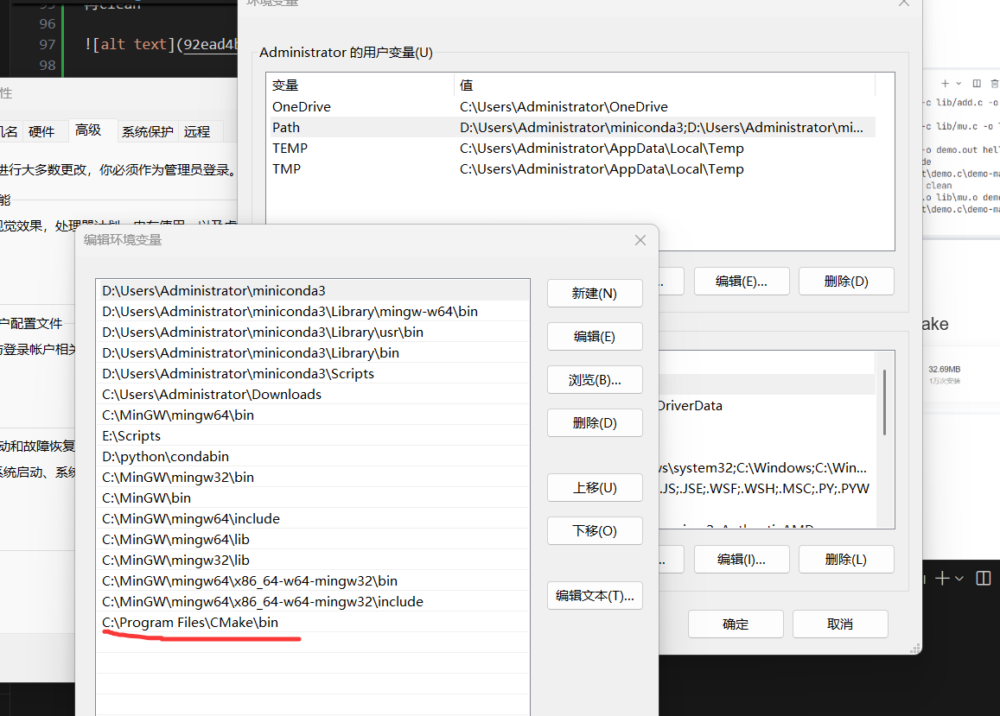
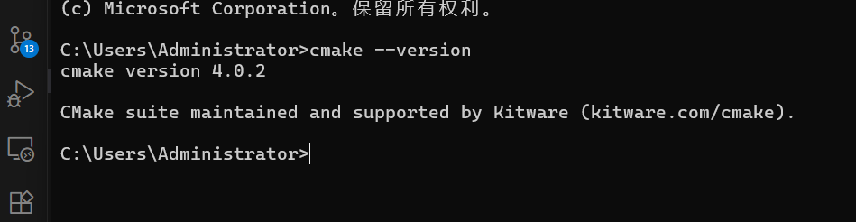
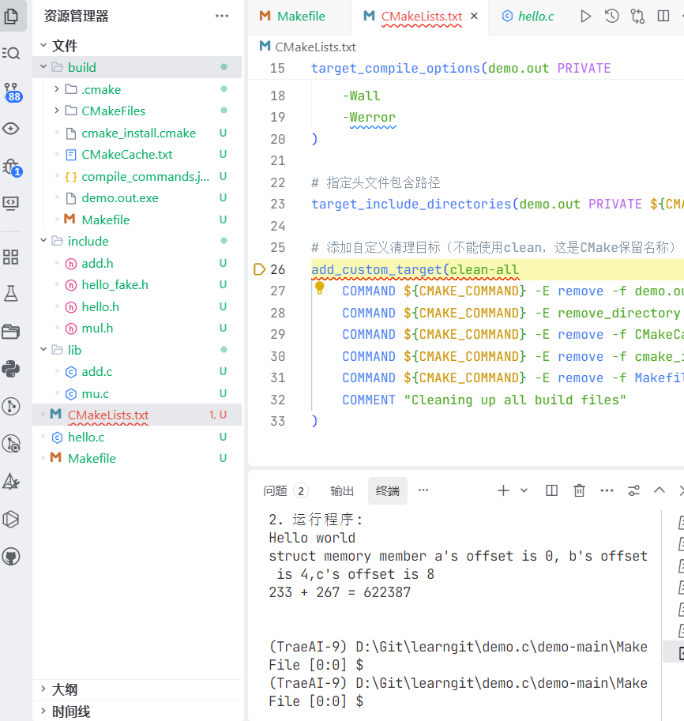

### 1.c源代码到可执行文件的完整流程
##### 预处理Preprocessing -> 编译Compilation -> 汇编Assembling -> 链接Linking
---
##### #预处理
由预处理器完成，主要将#开头指令进行处理，输出扩展后.i文件

- 展开 #include ：将头文件（如 stdio.h ）的内容直接插入到当前代码中
​
- 替换 #define ：将宏定义的常量/表达式替换到代码中（如 #define i 3 会把所有 i 换成 3 ）
​
- 处理条件编译：根据 #if / #ifdef / #else 等指令，保留符合条件的代码，删除不符合的部分
​
- 删除注释：将 // 或 /*...*/ 包裹的注释全部删除，避免干扰后续编译  
​`gcc -E hello.c    ->   hello.i`
---
##### #编译
编译由编译器完成，将预处理后的 .i 文件转化为汇编语言代码，输出 .s 文件。
​
- 语法/语义分析：检查代码是否符合C语言语法规则（如括号不匹配、变量未定义），若有错误直接报错（如“undefined reference to  printf ”）
​
- 优化代码：对代码进行逻辑优化（如删除冗余计算）、性能优化（如循环展开），提升最终程序的运行效率
​
- 生成汇编代码：将优化后的C代码，翻译成对应CPU架构的汇编指令（如 mov / add / call 等）  
​
  `gcc -S test.i -> test.s `
  
---

##### #汇编
汇编由汇编器完成，将 .s 文件的汇编指令转化为CPU可识别的二进制机器码，输出 .o 

- 指令映射：将每条汇编指令对应到CPU的二进制 opcode（如 0x01 d8 ）
​
- 生成符号表：记录目标文件中的变量、函数名称及其对应的内存地址（此时地址为“相对地址”，尚未确定最终位置）  
​
  ` gcc -c test.s -o test.o` 
---

##### #链接
链接由链接器完成，将多个 .o 目标文件（若代码依赖其他文件）和系统库文件（如 libc.so ）整合，最终生成可执行文件
 
- 合并目标文件：将多个 .o 文件的机器码、数据段合并到同一个内存空间。
​
- 解析符号引用：解决“外部依赖”，比如代码中调用的 printf 函数，会从系统的C标准库（ libc ）中找到其实际机器码并链接进来。
​
- 分配最终地址：给所有变量、函数分配程序运行时的“绝对内存地址”，确保指令能正确找到数据和函数。  
​
  `gcc test.o -o test` 
---
##### #questions
- 所以我使用gcc命令是直接完成了以上所有步骤吗？
- 我点f5运行时，是自动完成以上所有吗？（好6）
---
  

### 2.对比c和python
>- 编译型语言：需要先经过“编译 → 汇编 → 链接”等步骤，把源代码翻译成机器能直接运行的二进制程序，执行速度快，但调试起来可能稍麻烦。
>- 解释型语言：代码通常不需要提前编译，由解释器一行行读取、执行，开发效率高、调试灵活，但运行速度可能会慢一些。
  

##### #为什么 C 程序通常跑得比 Python 快？
- c在编译过程对代码进行了优化，中间不需要解释环节，而python每一行代码都需要进行语法解析、语义分析等操作
- c是静态类型语言，变量类型在编译时就确定，python是动态类型语言，变量类型在运行时才确定，需要额外时间去检查确定变量类型
##### #为什么很多团队会选择 “C++ 写核心逻辑，Python 负责调度” 的混合模式？
- C++是编译型语言，能直接编译成机器码，运行效率高，能满足这些高性能需求
​
- Python是解释型语言，语法简单，有丰富的库和框架，开发和调试速度快,用Python可以大幅提升开发效率，减少开发时间和成本
​
- C++有强大的底层能力，Python有较高的开发效率和可读性，混合模式能充分利用两者优势，让核心性能由C++保障，灵活调度和业务开发由Python负责 
##### #解释型语言真的就不用编译吗？（提示：其实 Python 也会先转成字节码 .pyc 再执行哟～）  
- CPython解释器在运行Python代码时，会先将源代码解析成字节码（Bytecode），这个过程可以看作是一种“编译”，不过产生的字节码不是机器码，而是一种中间表示形式。字节码比源代码更接近机器可执行的形式，执行效率更高。然后，Python虚拟机（PVM）逐行解释执行字节码。像 python hello.py 命令执行Python脚本时，就会先把 hello.py 的代码转为字节码，再由PVM解释执行    

- 解释型语言虽然不像编译型语言那样生成可直接运行的机器码，但为了高效执行代码，也会进行一些代码转换、优化的操作，这些操作和编译型语言编译过程中的部分环节类似 
---
### 3.github上的任务

好的我们打开了这个GitHub库，通过download zip我们成功下载了这个task

跟随我们自己的笔记，在终端分别输入预处理、编译、汇编、链接的指令，可以看到分别生成了.i、.s、.o、.exe的文件

*请忽略我输错了n次指令的愚蠢*

*ok也是一个都看不懂了*

接下来我们创建makefile吧！浅阅读了一下学长/学姐写的代码，好的暂时还是不为难自己了
在进行艰难的观看视频后，我写了一坨不知道什么东西，发现根本运行不了哈哈（苦涩）

**亦步亦趋**失效了

只好转战ai了，ai帮我修改的结果：

这你不得不佩服ai，一下子就可以成功make了，ai救我狗命

再clean

好的开始建立cmakelist了

我直接打开联想的应用商城，下了一个cmake

很easy
然后配置环境变量

还是很easy
确定一下cmake的存在

开始游历b站

##### 我的参考文献：https://www.bilibili.com/video/BV1vR4y1u77h?spm_id_from=333.788.player.switch&vd_source=1cf9ae4d63ff94aa45638c152e755eab&p=2

你就学吧，一学一个不吱声，学的想疯，学的想死，我还是觉得makefile简单一点，学cmake感觉跟再学一门编程语言没区别了wwwww

（感谢ai的倾情帮助）

*咱也不知道为什么报错，但是能运行*

也是建好库了，但我还是有点搞不清楚动态库和静态库
云里雾里
cmakelist属于CTRL C + CTRL V的功劳
这玩意儿必须理解并熟练应用吗？
它天天报错啊喂

==好了好了终于结束了==
==好痛苦，但是一次性关掉十几个页面的时候又好爽，感觉自己是m==
