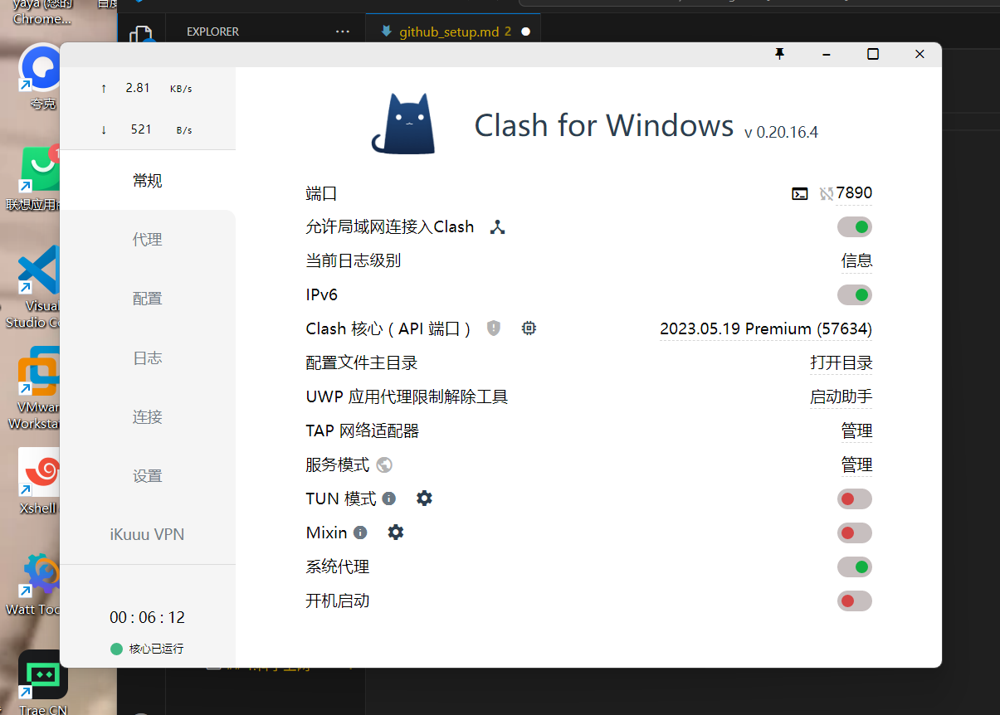
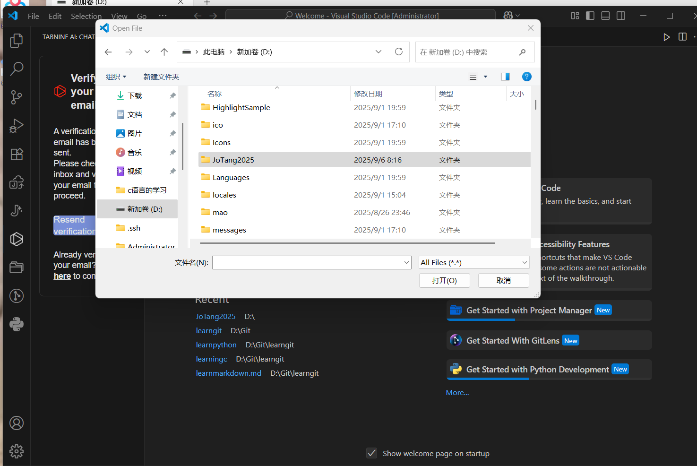
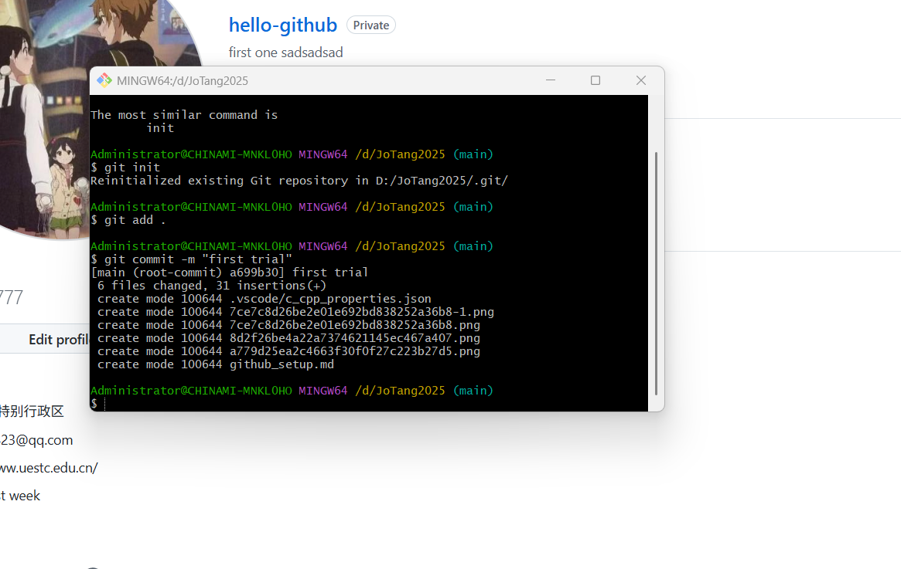
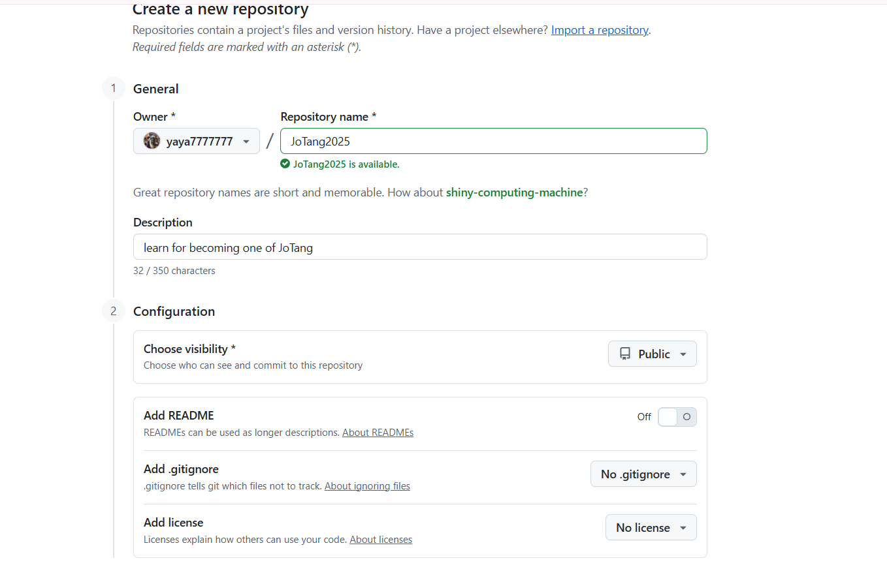
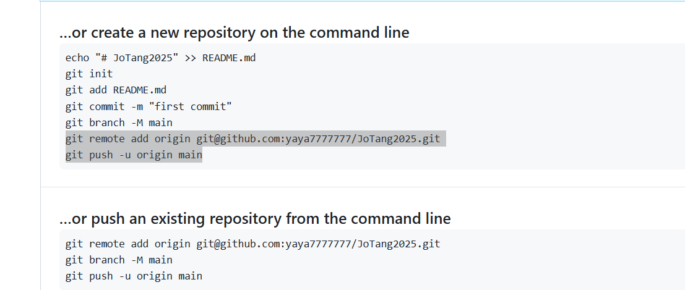
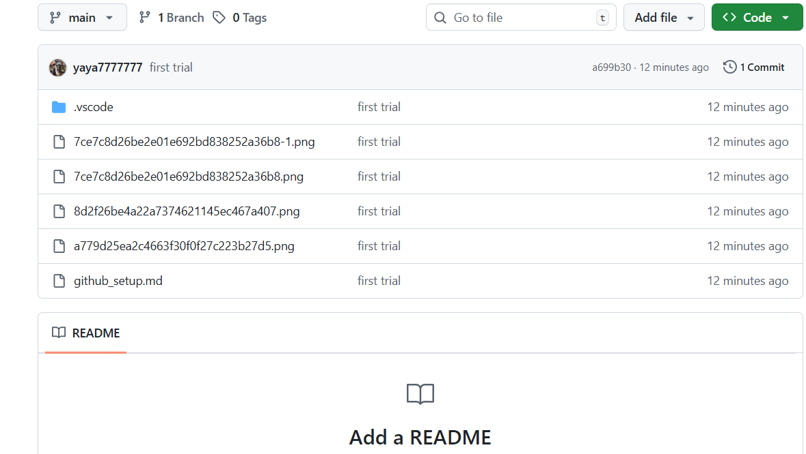

# 建立一个GitHub库
### 1.科学上网

这一步很easy，找梯子竟成最大困难
然后就可以注册一个谷歌账号

把页面浅浅更换一个令人愉悦的颜色
~~(粉色maybe)~~
然后就可以登录github

### 2.建立vscode和github的远程连接
首先创建一个file，然后下载git

用git bash打开这个file，输入网上搜的指令（完全看不懂）

在github建立一个仓库，再把这两条指令复制到git bash界面

完美大功告成啦

### 3.qustions
* 这个远程仓库建立必须得依赖git吗？
* 这个指令完全记不住好麻烦，我们只能这样做吗？
* 我在用了ssh连接VScode和github是没用的吗？我还以为可以直接在vscode上传，所以不可以吗？
* 那这个ssh是干什么的呢？
* ai让我下载git desktop，这有什么区别吗？