# 创建一个虚拟机
### 1.下载一个VMmare和镜像
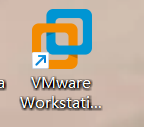
去清华大学镜像站，下载一个Ubuntu
mirrors.tuna.tsinghua.edu.cn
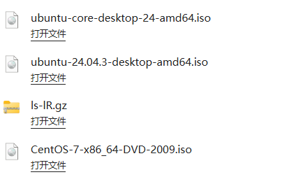
* 一定要下ubuntu桌面版
* 一定不可以下成centos  
* 
  惨痛教训在此

  ---

### 2.在VMmare上创建一个虚拟机
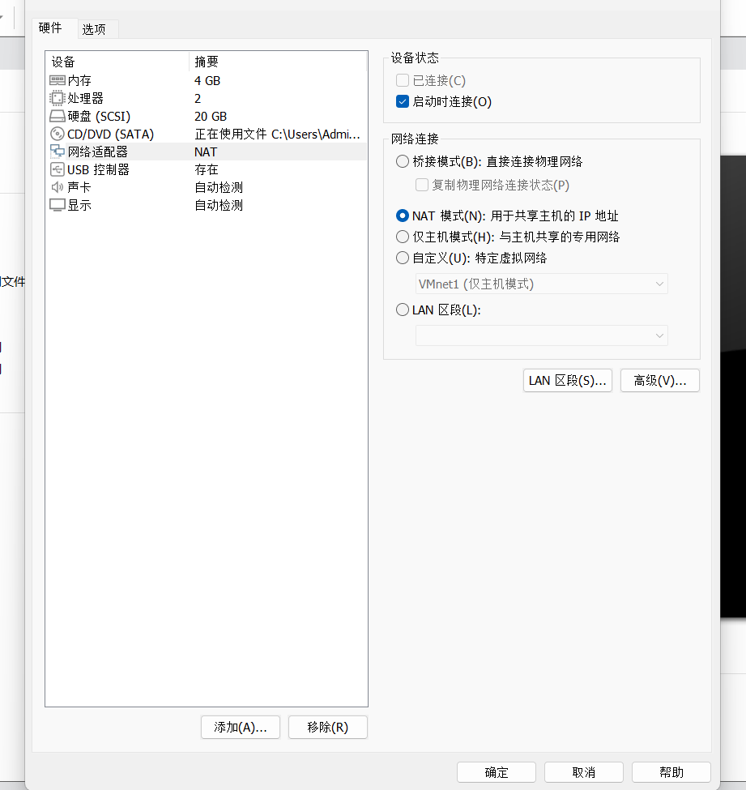

**网络选用NAT模式！！**

惨痛教训+1

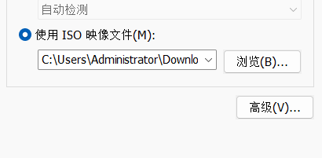

选则刚刚下载好的镜像文件

然后开始**痛苦**的设置网络

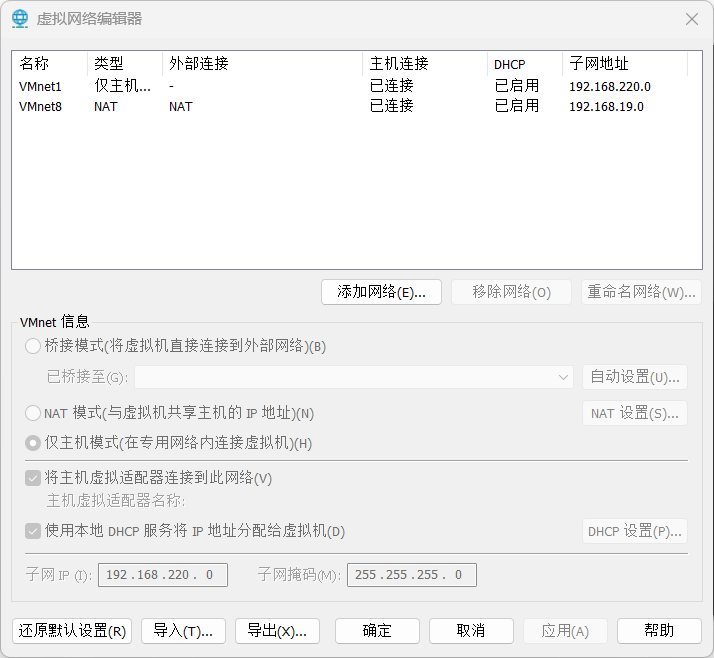

首先我们应该有VMnet1和VMnet8

把VMnet设置为NAT

**注意子网！！记住他的前三段**，子网掩码随便输一个就行

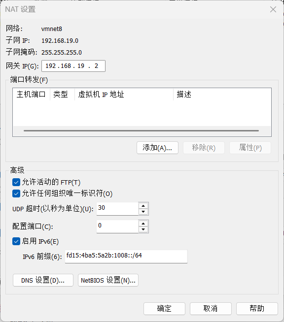

**网关必须前三段和子网一致**

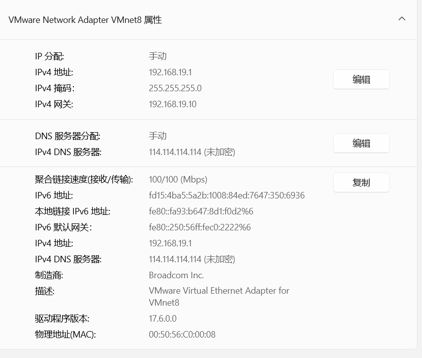

**同时在电脑的网络设置里，需要手动把IPv4地址设置与子网前三段一致**

惨痛教训+2

不设置上不了网你就知道什么叫崩溃了~~亲身经历~~

ok得到了一个虚拟机，只需要随便登录账号设置密码就可以使用了

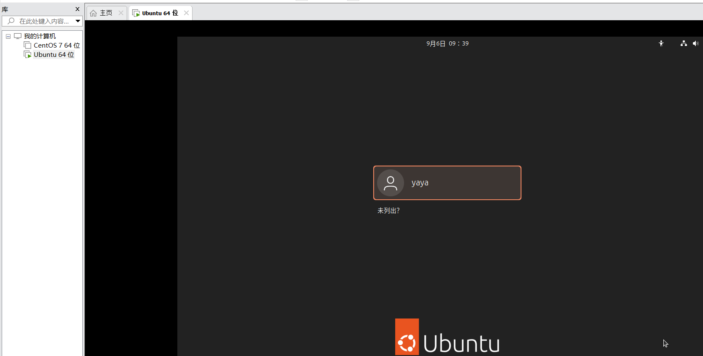
*可以看到我走的弯路，还下载了一个centos（哭泣）*

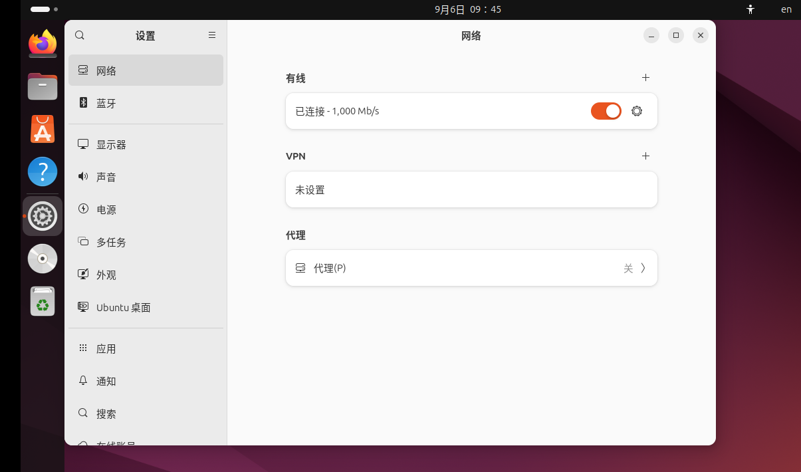

像这样就是连接好网络的一个完整的虚拟机了

---
### 3.通过ssh连接主机和虚拟机

首先需要下载一个xshell

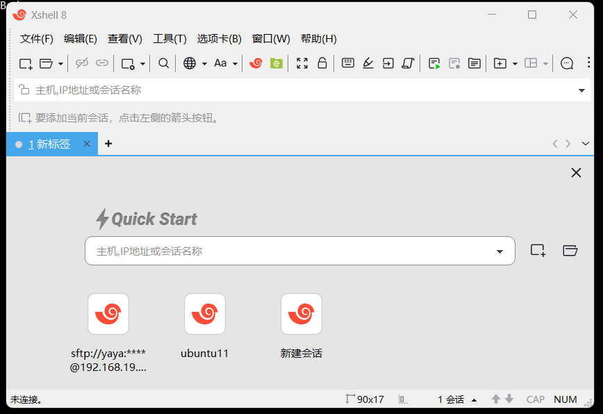

ok可以看到我是连接好了补的截图（bushi）

我们新建一个会话

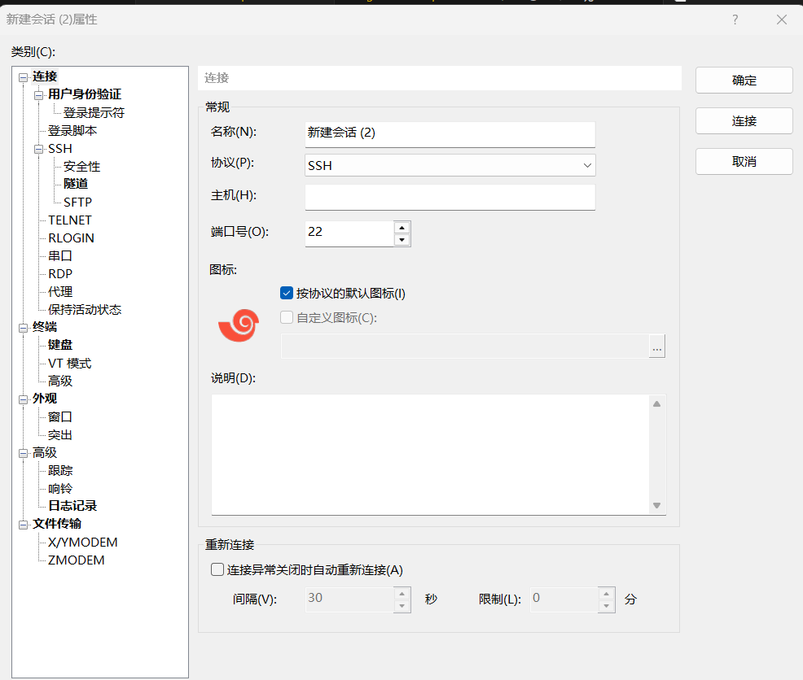

在主机那个地方填上我们虚拟机的网络ip

这个在哪里查看呢

就是刚刚我们设置网络那里

然后我们可以先ping看看是否两边接通

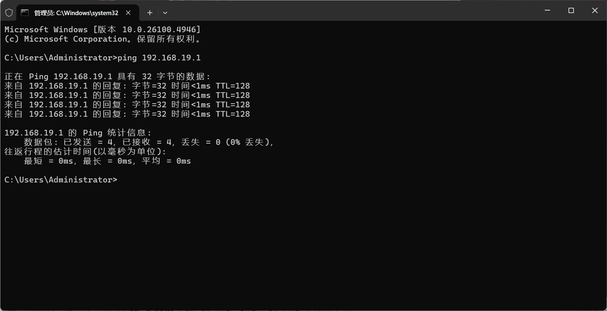
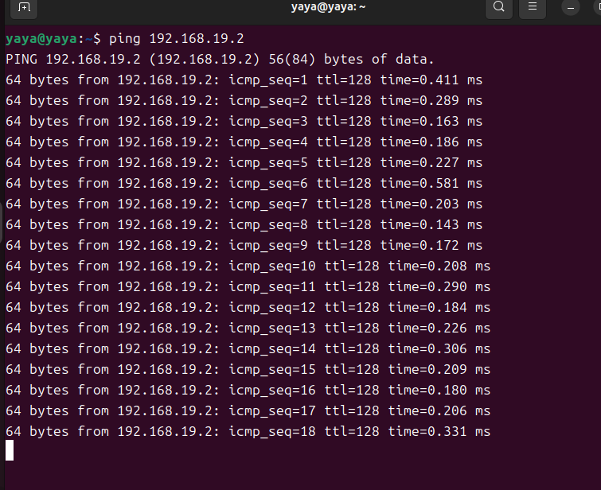

这样就是ok的

然后在网上找个教程一步一步输入指令

只要**亦步亦趋**就会成功的！

#### 我的参考文献：[SSH远程连接详细步骤](https://www.bilibili.com/video/BV1RF11YzEV9/?spm_id_from=333.337.search-card.all.click&vd_source=1cf9ae4d63ff94aa45638c152e755eab)

然后我就没截上图了，，，，

不过值得注意的是这一步

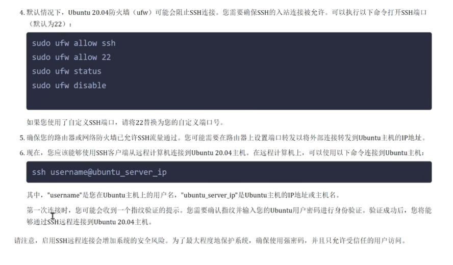
**我们需要解决掉我们的防火墙**

惨痛教训+3

OK呀我们就完成了虚拟机的创建

---
### 4.ideas

* 创建虚拟机是个痛苦的过程，只能跟着教程一步一步来，网络设置的教程，ssh的教程，各种突发问题还需要ai帮我们解答      
* 但是创建虚拟机很有用，linux上运行vscode简单多了，这个ubuntu上还可以下任何软件，解放主机，避免主机盘里全是杂七杂八的东西