### #基本概念理解

#### 1.偏导数、链式法则、梯度、矩阵等数学概念在机器学习中的作用？
  - 偏导数：损失函数通常是多变量函数，偏导数用于衡量函数在**某一变量方向上的变化率**，是梯度下降等优化算法中计算参数更新量的基础，帮助找到使损失函数最小的参数
  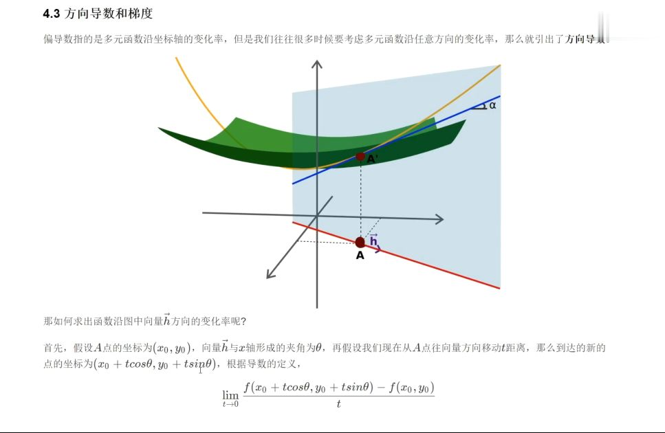
  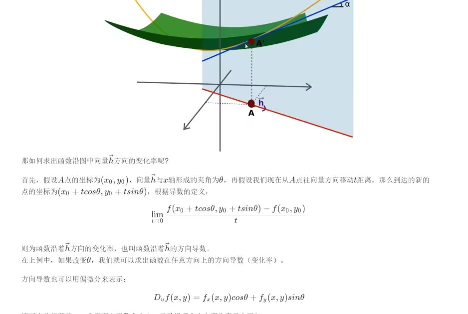
  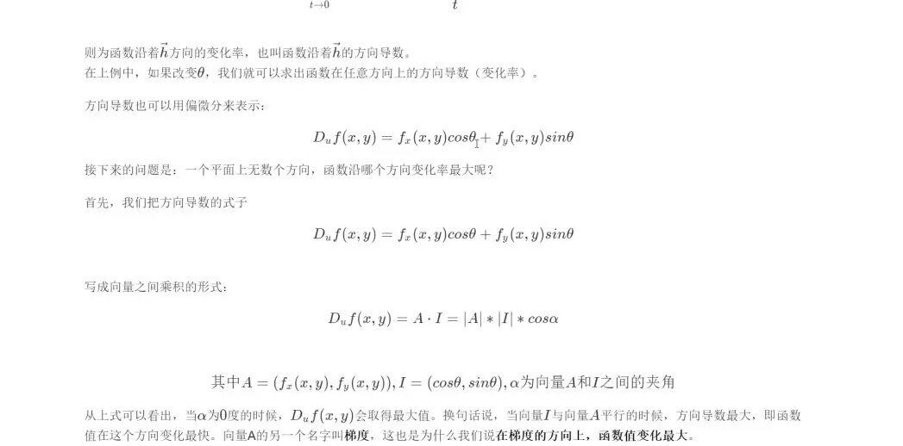
​
  - 链式法则：**用于计算复合函数的导数**,通过链式法则，可以高效地从输出层向输入层反向计算各层参数的梯度，从而实现参数的更新
​
  - 梯度：**是函数在某一点处的所有偏导数组成的向量，指向函数值增长最快的方向**，在优化算法中，沿着梯度的反方向更新参数，能使损失函数快速下降，找到最优参数。
  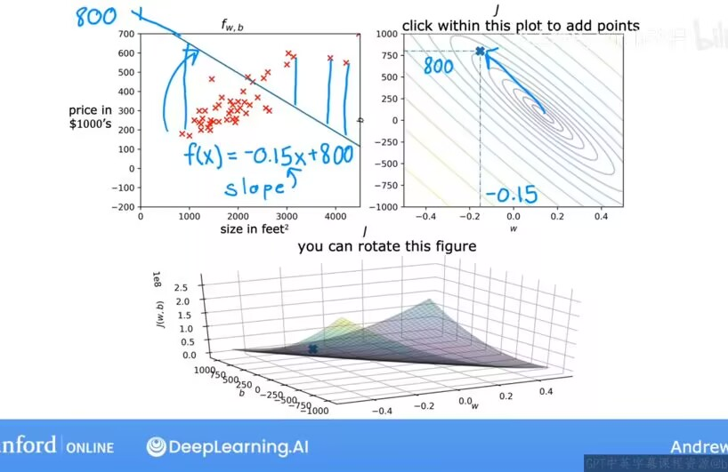
​
  - 矩阵：机器学习中大量数据以矩阵形式表示（如样本特征矩阵），矩阵运算可以高效地处理**高维数据**。在神经网络中，依赖矩阵乘法来实现**批量数据**的快速计算
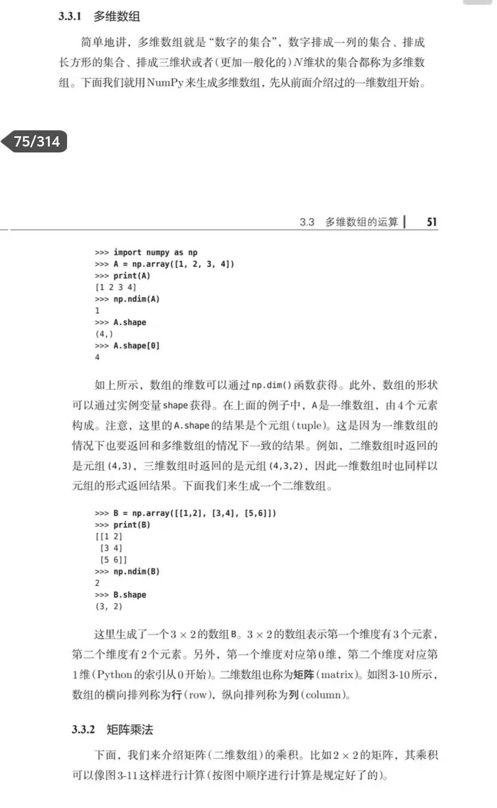

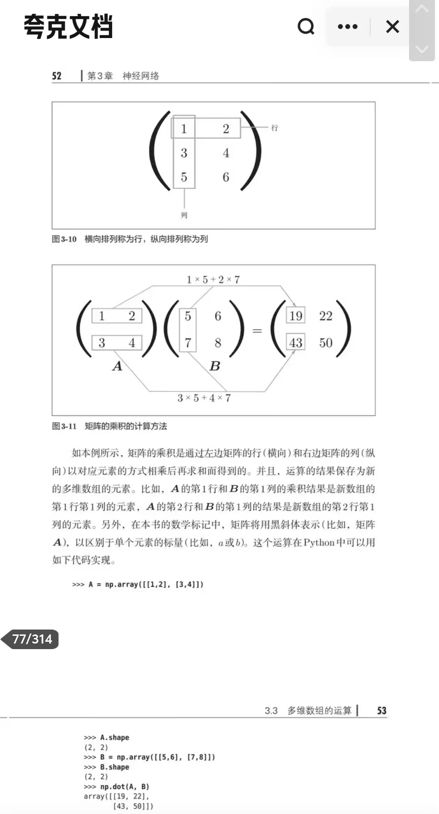
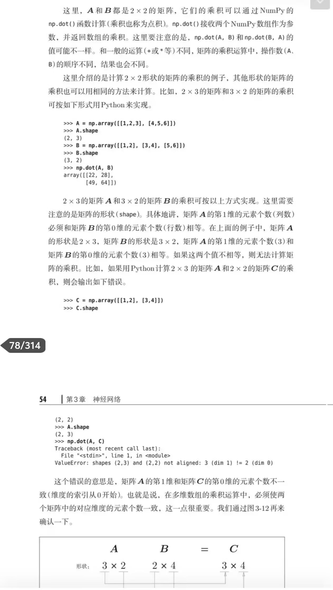
#### 2.什么是“模型”？机器学习中的模型是如何工作的？  

  - 模型：是对现实世界中某种现象或关系的数学抽象表示。在机器学习里，模型是通过学习数据中的规律，来对未知数据进行预测或分类等任务的算法结构
​
  - 工作方式：模型先通过训练数据学习，调整自身参数以拟合数据中的结构。训练完成后，当输入新的测试数据时，模型利用已学习到的参数和结构，对数据进行处理，输出预测结果

#### 3.模型没有生物的意识和记忆，它们是如何“学习”的？

  - 模型的“学习”是通过优化算法不断**调整自身参数**（权重和偏置）来实现的。在训练过程中，模型根据输入**数据和对应的标签（监督学习）或数据本身的结构（无监督学习）**，计算预测结果与真实结果的误差（损失）。然后利用梯度下降等优化方法，按照一定的规则调整参数，使得损失逐渐减小，这个过程就是模型的“学习”

#### 4.什么是监督学习？什么是无监督学习？请分别举一个例子。
  - 监督学习：是从**带有标签的训练数据**中学习输入到输出的映射关系的机器学习任务  
  例如预测数据，训练数据中分别有房子的大小、年龄、房间个数等参数和目标值标签（正确的房价），经过训练后，模型能对一个未卖出的房子根据参数预测其卖出价格
​
  - 无监督学习：是在**没有标签的训练数据**中，发现数据内在结构或规律的机器学习任务
  例如聚类，给定一堆没有标签的婴幼儿产品数据，通过无监督学习可以将相似的产品归为一类。
  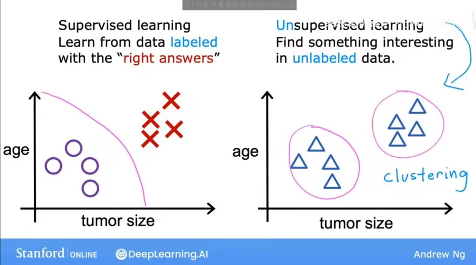

#### 5.AI 是什么？深度学习和传统机器学习的区别？

  - AI：即人工智能，是研究、开发用于模拟、延伸和扩展人的智能的理论、方法、技术及应用系统的一门新的技术科学，旨在让机器具备像人类一样的感知、认知、决策等能力(摘自百度)
​
  - 区别：
​
    - 特征提取：传统机器学习需要人工设计特征，而深度学习能自动从数据中学习特征模型，无需过多人工干预
​
    - 模型结构：传统机器学习模型相对简单，深度学习通常采用深度神经网络，模型结构复杂，能处理更复杂的关系
​
    - 数据规模：传统机器学习在小数据量下也能有较好表现，深度学习更依赖大规模数据来发挥其优势

#### 6.怎么用矩阵乘法表示神经网络的全连接层前向传播过程？

- 假设全连接层的输入为向量  $\boldsymbol{x} \in \mathbb{R}^{n}$（其中  n  是输入特征的数量），权重矩阵为$\boldsymbol{W} \in \mathbb{R}^{m \times n}$（其中  m  是该层输出神经元的数量），偏置向量为  $\boldsymbol{b} \in \mathbb{R}^{m}$ 
 
  全连接层的前向传播过程可以表示为：

  $\boldsymbol{z} = \boldsymbol{W}\boldsymbol{x} + \boldsymbol{b}$

  其中， $\boldsymbol{z}$ 是经过线性变换后的输出向量。之后， $\boldsymbol{z}$  通常会再经过激活函数（如 ReLU、Sigmoid 等），得到该层最终的输出。
 
  如果是批量数据（即同时处理多个样本），输入为矩阵  $\boldsymbol{X} \in \mathbb{R}^{b \times n}$（其中  b  是批量大小），那么前向传播过程为：

  $\boldsymbol{Z} = \boldsymbol{W}\boldsymbol{X} + \boldsymbol{b}$

 这里，偏置  $\boldsymbol{b}$  会通过广播机制与矩阵乘法的结果相加

*广播：使两个维度的大小相等；其中一个维度的大小为1（可以被“拉伸”到与另一个维度匹配）*|

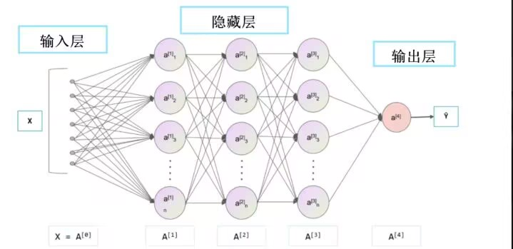

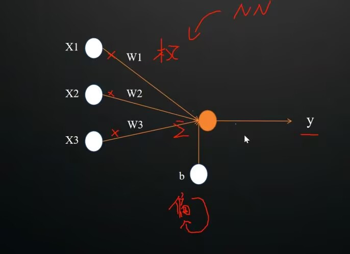

---

### #搭建环境

首先我们安装一下anaconda，显然我的笔记本运行不了这么重量级的环境，所以我选择miniconda

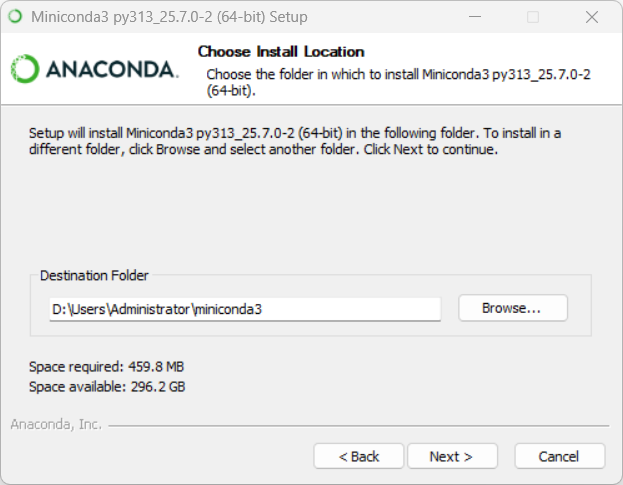

漫长的等待后我们下载一些conda常用的库，like this：

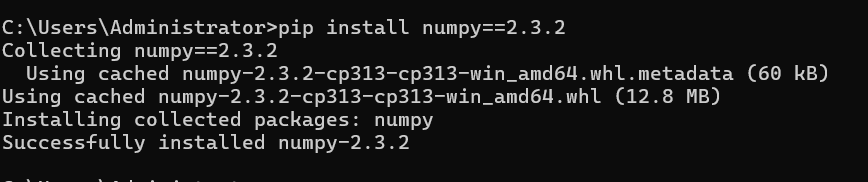

然后下载一个适合自己电脑的pytorch
我的电脑有英伟达显卡（GPU），所以可以进行深度学习

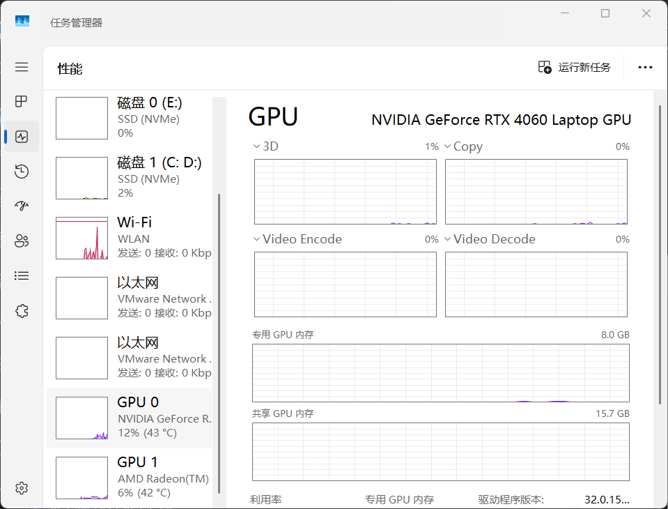

**不要选最新版本！！！它不兼容！！！**

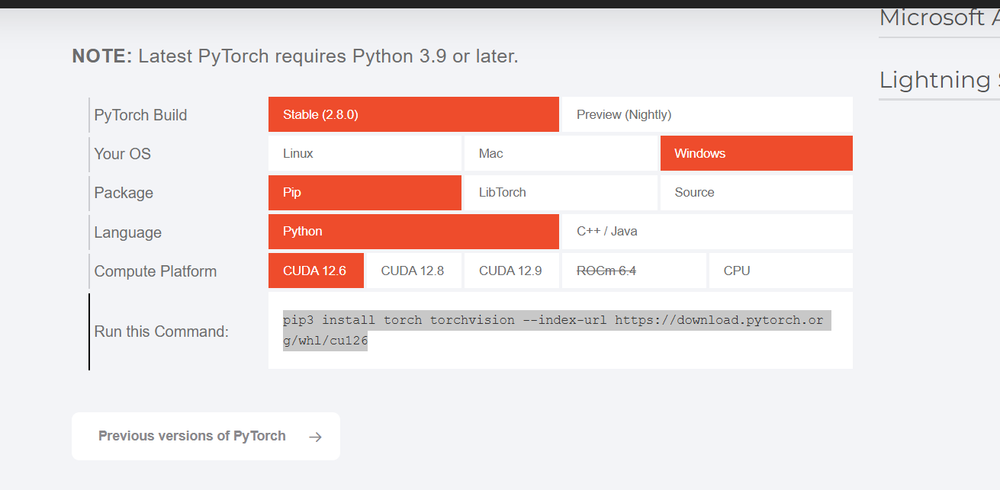

如果下载很慢很慢可以用清华源，据说快一点，但我感觉直接从官网下也不是很慢，所以我没用

清华源指令：pip3 install torch torchvision torchaudio --index-url https://pypi.tuna.tsinghua.edu.cn/simple -f https://download.pytorch.org/whl/cu121

创建一个python的虚拟环境

**一定不要用太低版本的python！！！**  
惨痛教训+n  
因为从官网下的pytorch是新版，如果python版本太低会报错

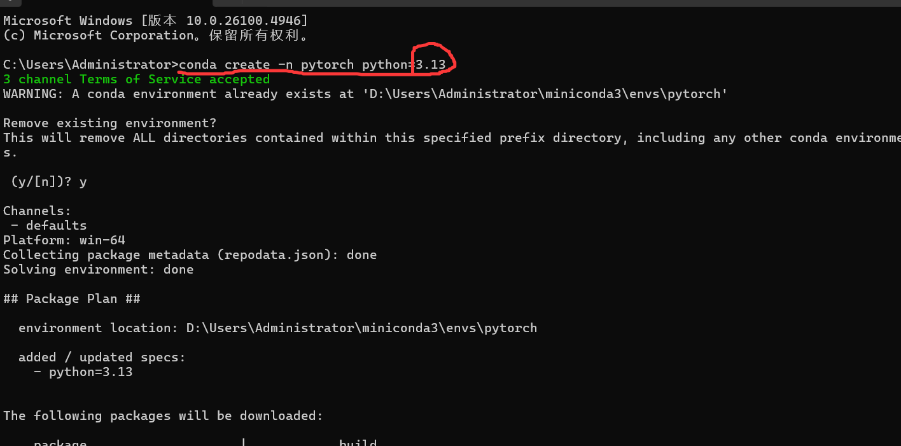

这样可以在list里看见torch就是下好了

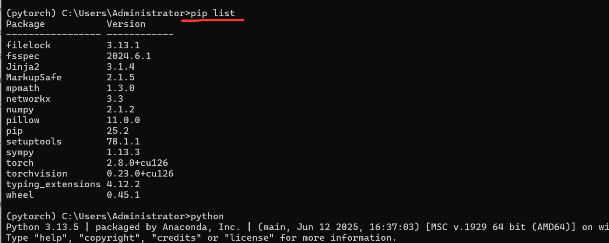

我们可以再检查一下自己有没有GPU，先进入python运行环境

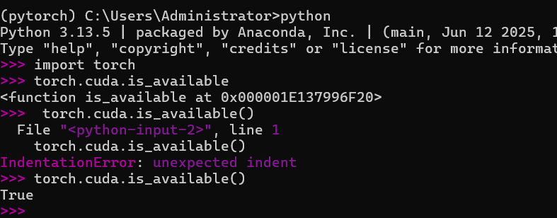

接着在vscode进入我们刚刚创建的环境中尝试一下

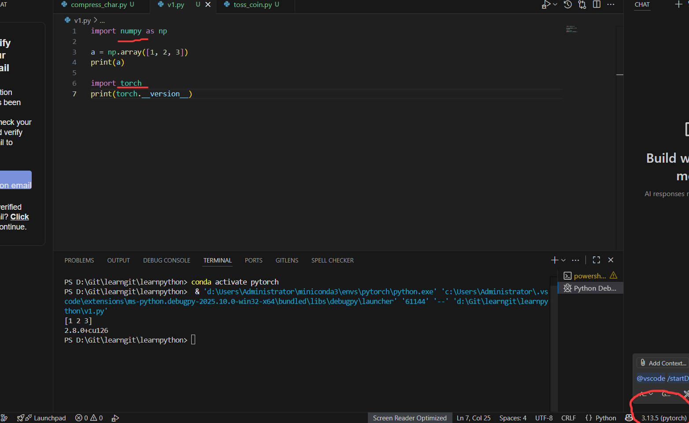

ok呀我们也是成功了

---

### #ideas
   - 每次运行都搭建一个虚拟环境，隔离不同项目，避免混乱；解决版本冲突，使不同的python和库互不干扰
   - 用GPU进行深度学习，大大提高训练效率
   - 利用梯度下降，改变模型参数使误差越来越小的过程是完全自主的，无需人工干预
   - 这玩意儿纯纯大数据时代产物啊,依靠大量数据样本进行学习
