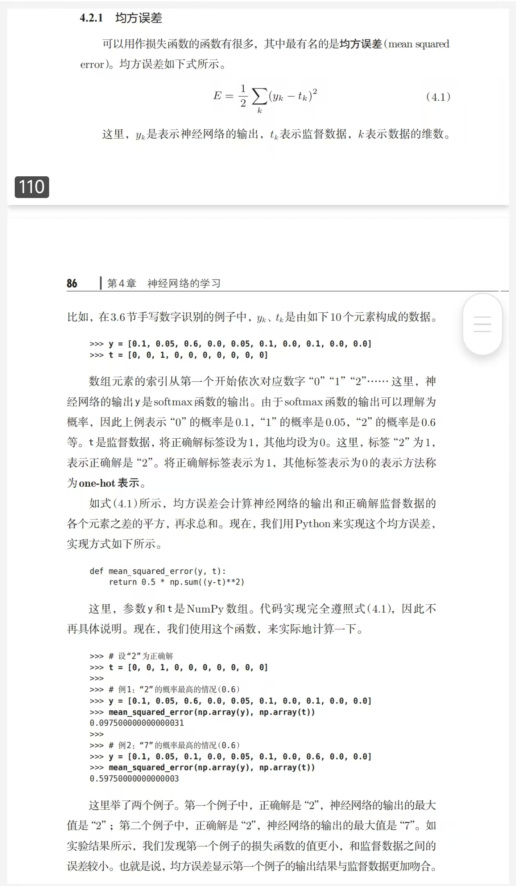
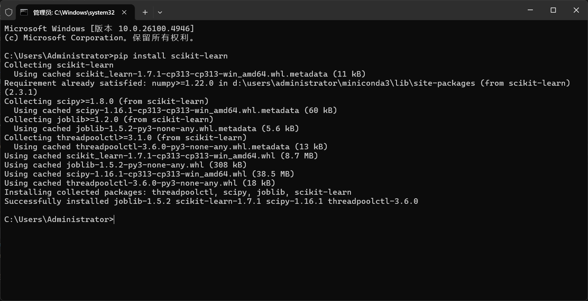

### #概念理解

>这网站好玩：[Neural Network Playground](https://playground.tensorflow.org/#activation=tanh&batchSize=10&dataset=circle&regDataset=reg-plane&learningRate=0.03&regularizationRate=0&noise=0&networkShape=4,2&seed=0.51895&showTestData=false&discretize=false&percTrainData=50&x=true&y=true&xTimesY=false&xSquared=false&ySquared=false&cosX=false&sinX=false&cosY=false&sinY=false&collectStats=false&problem=classification&initZero=false&hideText=false)

ps 我还看了一本入门书：*《深度学习入门：基于python的理论与实践》*
我觉得海星，以下也有许多截图来自此书

#### 1.什么是多层感知机（MLP）？其结构是怎样的？  

- 定义：是一种前馈人工神经网络模型，由输入层、隐藏层和输出层组成，能学习输入和输出之间的非线性关系
  
- 结构：<u>输入层</u>接收数据；<u>隐藏层</u>对数据进行非线性变换，可多层；<u>输出层</u>产生最终结果，如分类的类别或回归的数值

#### 2.数据在神经网络中扮演哪些角色？（数据集的 split 和处理）

- split：通常将数据集分为**训练集、验证集和测试集**，训练集用于训练模型(类似于**作业**)，验证集用于调整模型超参数（类似于**周考月考**），测试集用于评估模型泛化能力（类似于**高考**）
  
- 处理：包括**数据清洗**（处理缺失值、异常值等）、**标准化**（如将数据缩放到均值为0、方差为1）、**归一化**（将数据映射到特定区间，如[0,1]）等，对数据进行处理

#### 3.噪声是什么？特征是什么？标签是什么？  

- 噪声：数据中无关的干扰信息  
  
- 特征：数据中用于描述样本的属性 

- 标签：样本的目标值,是模型的目标 （如分类任务中的类别，回归任务中的具体数值）
  

*可以看到影响最终图像分布*

#### 4.Batch size 是什么？为什么堆叠成 Batch 可以提高运算速度？

- 定义：每次训练时输入模型的样本数量  
  
- 提速原因：通过并行计算，一次计算多个样本的梯度（批量进行）并更新参数，从而提高运算速度  
  

#### 5.神经元是什么？  

- 神经元是神经网络的基本计算单元，模拟生物神经元的结构和功能。它接收输入信号，对输入进行加权求和，再通过激活函数处理，产生输出信号传递给下一层神经元

#### 6.什么是激活函数？常见的激活函数有哪些？什么叫“非线性表达能力”？

- 激活函数定义：对神经元的输入进行非线性变换，为神经网络引入非线性，使网络能学习复杂的非线性关系

- 常见激活函数：
  - Sigmoid：将输入映射到(0,1)区间，可用于二分类输出等
  - ReLU（修正线性单元）：输入大于0时输出自身，否则输出0，计算简单且能缓解梯度消失问题
  
  
  
  

  
  
- 非线性表达能力：指激活函数能使神经网络突破线性组合的限制，从而能够拟合复杂的非线性函数，学习数据中更复杂的模式

#### 7.什么是计算图？它和数据结构/离散数学中学的图有什么区别？怎么构建计算图？

- 计算图定义：是一种用于表示神经网络中的计算操作和数据流动的图，图中的节点表示操作（如加法、乘法、激活函数等），边表示数据（张量）的流动
  
- 与数据结构/离散数学中图的区别：数据结构/离散数学中的图更侧重于表示节点和边的关系（如连通性、路径等）；而计算图专门用于表示神经网络的计算过程，节点是特定的计算操作，边是数据张量

- 构建计算图：在深度学习框架（如PyTorch）中，当定义神经网络的层、操作时，框架会自动构建计算图，记录操作之间的依赖关系和数据流动路径

#### 8.怎么计算MLP的参数量？什么是超参数？MLP有哪些超参数？

- 参数量计算：MLP的总参数数量是所有层的权重参数和偏置参数的总和。假设MLP有一个输入层、L-1个隐层和一个输出层，总参数数量P的计算公式为$P = \sum_{l=1}^{L} W_l + \sum_{l=1}^{L} B_l$，其中$W_l$表示第l层的权重参数数量，$B_l$表示第l层的偏置参数数量

>e.g.一个MLP结构的输入层有10个神经元，第1隐层有5个神经元，第2隐层有3个神经元，输出层有2个神经元。
> - 第1层（输入层到第1隐藏层）：权重参数数量为10×5 = 50，偏置参数数量为5。
>- 第2层（第1隐藏层到第2隐藏层）：权重参数数量为5×3 = 15，偏置参数数量为3
​
>- 第3层（第2隐藏层到输出层）：权重参数数量为3×2 = 6，偏置参数数量为2
 >则该MLP的总参数数量为(50 + 15 + 6)+(5 + 3 + 2)=71 + 10 = 81
 
 **MLP的总参数量是各层参数量之和**  

- 超参数：是在训练前需要人为设置的参数，不是通过训练学习得到的（随机设置，需要调节）  

- MLP的超参数有隐藏层数量、每层隐藏神经元数量、学习率、Batch size、训练轮数、激活函数选择等

#### 9.什么是隐藏层（hidden layers）？它为什么叫这个名字？

- 隐藏层定义：是介于输入层和输出层之间的神经网络层

- 名字由来：因为在网络中，这些层的输出不会直接作为最终结果输出到外界，对外部来说是“隐藏”的

#### 10.什么是损失函数？什么任务用什么损失函数？

- 损失函数定义：用于衡量模型预测值与真实值之间的差异
  

  
- 任务与损失函数：
  - 分类任务（二分类）：常用交叉熵损失（如二元交叉熵）
  
  - 分类任务（多分类）：常用 categorical 交叉熵损失
  （*搜索的，还没看到这儿，不是很懂*）

  （学完回来发现多分类用的也是交叉熵来着，是利用交叉熵内置的softmax实现的）
  

#### 11.前向传播是什么？梯度是什么？学习率是什么？反向传播是什么？有哪些常见的优化器？

- 前向传播：从输入层开始，依次经过各隐藏层，最后到输出层，计算出模型预测值的过程

- 梯度：是函数在某一点的导数，表示函数在该点的变化率
  在神经网络中，梯度用于指示参数更新的方向

  
- 反向传播：从输出层开始，根据损失函数计算的误差，反向计算各层参数的梯度，并利用梯度下降等方法更新参数的过程

  
- 常见优化器：
  - SGD：随机梯度下降，最基础的优化器，收敛速度慢易震荡
  （学完了倒回来补充：SGD适用于单个或小批量样本）

  - Adam：结合了动量和自适应学习率，收敛速度快且稳定
   （学完了倒回来补充：适用于cnn，transformer）

  - AdamW：在Adam上添加weight decay
   （学完了倒回来补充：提高Adam泛化性，适用于大量数据防止过拟合）

#### 12.归一化是什么？正则化是什么？

- 归一化：将数据转换到特定范围（如[0,1]或均值为0、方差为1），使不同特征的量纲一致
  

  
- 正则化：用于防止模型过拟合的技术，通过在损失函数中添加正则项（如L1、L2正则），限制参数的大小，使模型更简单、泛化能力更强

  
  
#### 13.什么是欠拟合？什么是过拟合？

- 过拟合：模型过于复杂，过度学习了训练数据中的噪声和个别样本的特点，导致在训练集上性能很好，但在测试集上泛化性能差

- 欠拟合：模型过于简单，没有充分学习训练数据中的模式和特点，导致对训练集拟合程度差，在测试集上预测不准确

---

### #实践

first of all,install 一个我们需要的库scikitlearn
去官网就ok了

CTRL C + CTRL V

然后根据网上教程和pytorch官方资料
艰难且苦涩的进行编写

参考文献：
[Learn the Basics — PyTorch Tutorials 2.7.0+cu126 documentation ](https://docs.pytorch.org/tutorials/beginner/basics/intro.html)

**建立数据库时要求必须建立这三个函数！！**

我们接着建立神经网络nn，我建的是两个隐藏层的神经网络，下次可以试试更多层

此处的relu应该要在每一次进入下一层时调用，作为激活函数，~~但我懒，自动省去~~

（现在学了更多的我发现每一层后面根本只需要直接写输入输出数，激活函数和每一层也可以写在一起！！我最开始真傻真的）

一层连接一层，十分具有美感 ~~（因为可以CTRL V）~~

先从.csv导入数据

然后对数据进行划分，网上说只用化为训练集和验证集，但为了完整性，这里我们还是设置了一个测试集

**一定要对划分的数据集取int！！否侧会有小数**

**最后一个一定要是减前两个！！否则加起来可能不等于全集**

惨痛教训 + N+1

然后就要计算准确率，我们需要得到误差然后才能进行反向传播

model.eval是为了进入评估模式，使推理过程稳定

with torch.no_grad是关闭梯度计算，节省内存

统计预测正确的样本数，.item是只读取标量数据，避免环境变量影响

然后我把它改成了函数的形式，这个时候我惊奇的发现：

**我没有办法记录我的训练过程，我没有返回值！！**

于是我又双叒叕进行了修改，我增加了一个history的字典，用于保存我进行过程中的准确率，以便返回进行反向传播

然后就可以开始我们的训练过程

**确保保存路径存在！！很重要！！不然你就会什么也得不到**

惨痛教训 + N+2

我们遍历每一个数据，再把他们送进device，利用我们构建的神经网络model向前传播，再把准确率得到反向传播

optimizer函数会调用优化器帮我们更新参数

criterion函数可以帮我们计算损失

*（ps.  python也是很爽了，有足够丰富的函数库，可以直接调用，但是这些函数的内部原理是什么可能还需要更加深刻的理解才行）*

哦对，这里的tqdm是我copy的，据说可以显示训练进度条，虽然但是我没有看到？？？

（更新进度这里是在pytorch网站上抄的，理解一下）

为了方便理解，我让ai帮我标注了每一步操作的意义，虽然但是应该没人能记住吧？？？

在主函数调用一下以上函数

然后编译运行主函数

ok毫无疑问，出问题了

没办法了只能one again

再运行一下试试

再来一遍

这下总行了吧，，，

没有data！！？？

我先问了一下ai，ai说直接import scikit_learn啊

挣扎了半个小时

我选择打开了trae

值得注意的是它帮我加了这个：

##### **蛙趣，原来data要自己生成啊！！所以scikit只是控制格式么？！**

官网和教程都没人说啊，默认我有data了是吧

（学完了发现是我自己弄错了，根本不需要自己生成，真的只需要引用就可以了，所以ai是人工智障呢，遂把生成数据的版块删掉了）

看一下来之不易的数据

显然看不懂，不过这样我们就大功告成了！

接着我又手动更改了一下noise，似乎也可以写个循环来更改noise，然后得到的图我们可以看到曲线波动和散点范围都有了增大（虽然还是很微小）

---
### #
- 用 matplotlib 将数据集可视化，想想怎么从数学层面表达你选用的数据集？
  
  - 这些数据有两个特征，所以可以表示为二维平面上的点，其分布满足一定的关系，形成月牙形

- 模型的输出表示的应该是这个样本属于每个类别的概率值，所有类别（这里是 2 个）的概率值加起来为 1（你是通过什么手段保证这一点的？如果有更多类呢）
  
   - 输出层运用了softmax函数（ $S(y_i) = \frac{e^{y_i}}{\sum_{j=1}^{n} e^{y_j}}$ （其中  n  是类别数，这里  n = 2 ） ）,将模型输出的原始数据转换为概率且所有类别概率和为1

     当然，多类别也可以使用softmax函数

- 对比三者训练/推理速度，分析原因（为什么更快/慢，他们大致的底层原理分别是？对硬件的利用情况如何？）
  
    - 没看懂问题，哪里来的三者啊？
    - 那我就对比一下训练和推理过程吧
      
       - 训练过程要进行多次循环，并需要计算损失，反向传播更新参数等，所以较慢。底层原理根据梯度下降，对GPU利用较好，因为要进行矩阵运算
       - 推理过程只需要前向传播，所以速度快。底层原理是是数据通过多层计算，可利用GPU快速处理大量数据
  

  ---

### #总结一下

- 首先，建立一个二分类模型需要下载csv数据库；然后我们需要对数据库进行规定三步动作：init/len/getitem；接着建立神经网络（采用relu和softmax函数），划分数据集；再进行前向和反向传播，得到准确率和损失对参数进行调整；最后加上我们需要的可视化

   这样我们就可以运行一个二分类模型了

- 这些可视化图片代表什么准确含义？？有点看不懂，，
  还有可视化的代码真的记不住啊！只能去copy

- 这些库里面还有哪些有意思的函数，希望接下来的任务可以探索一下！
  （现在我知道了，原来所有模型都不用自己建立，基本上的函数也不用自己写，甚至循环都可以不用自己循环，这个预制库太丰富了，但是令人崩溃的是，到底谁能记住这么多调用？？？）

- 完结撒花

