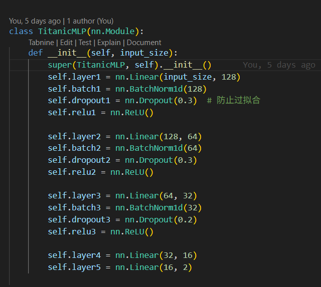

### #二分类代码实践

首先，需要学习一下如何下载titanic的数据

我先登录了kaggle账号，搜索titanic

因为看不懂随便点了第一个，里面就有比赛的要求及数据库

然后把它下载下来就ok了

接下来需要了解数据处理

我的学习资料 ：[泰坦尼克号生存预测(超详细)](https://blog.csdn.net/s_m_c/article/details/112653259?sharetype=blog&shareId=112653259&sharerefer=APP&sharesource=2501_93331212&sharefrom=link)

根据里面的内容我大致知道了要处理缺失值，并把字符型特征转化

但是我发现这里没有关于异常值的处理

于是又去CSDN上搜寻了一番

找到了新的资料：[python中异常值的检测和处理](https://blog.csdn.net/AndersonHuang/article/details/134860432?sharetype=blog&shareId=134860432&sharerefer=APP&sharesource=2501_93331212&sharefrom=link)

[时间序列中的6大类10种异常值处理方法(从根源上提高预测精度)](https://blog.csdn.net/java1314777/article/details/134470329?sharetype=blog&shareId=134470329&sharerefer=APP&sharesource=2501_93331212&sharefrom=link)

然后开始处理

我采用了**箱线图**检测异常值，将高于上四分位数和低于下四分位数的值进行保存并以中位数（median）替换

（**z-score**适用于正态分布数据）

接着定义一个预处理函数，前面和其他任务一样，读取保存data

不同的是，在这里，我们做一个将train和test的数据合并的操作
便于后面我们一起处理所有数据

**concat用于拼接数据，axis=0为上下拼接，axis=1为左右拼接**，此处我们需要上下拼接

数据特征我们用平均值（mean）来代替

字符特征我们用众数来代替

缺失的字符特征用U来表示unkown

接下来对剩下字符特征进行特征处理

将性别用数值代替

将客舱等级，登船港口进行**one——hot编码**

大概就是将不同类别转化为二进制向量，以表示类别信息

**（倒回来我发现了为什么不可以用数值代替类别：用123等表示，类别会有虚假的大小排序，但实际上这些类别时平行无序的）**

再把新生成的热码替换原来的类别字符

可以看到，对于title和sibsp,parch它就不是普通分类的问题

我们需要对其进行****特征提取**

比如我们可以把title进行提取，将其与对应的身份阶级联系在一起

然后将sibsp，parch合成一个特征，即family size

*想出这些处理的人真聪明啊*

接着就把处理过后的特征全部加到我们要选择使用的特征数组中去

将所有数值类的特征进行归一化

select_dtypes(include=[np.number])挑选出是数值的类别，将类名columns存入numeric_cols

fit_transform进行归一化计算再赋值会full_features[numeric_cols]

最后合并回原数据列

然后再把train和test分回去

然后开始建立模型

这里是一道二分类的题，我采用了MLP

（因为感觉用mlp准确率不够高的话可以增加网络的深度和宽度（bushi））

batchnom1d是用于批量归一化一维数据

dropout是随机丢弃括号内概率的神经元，进行正则化，防止过拟合

**这里的输出是2维，只有存活或不存活，保证最后输出层输出2维就好**

然后操作就大差不差，但是这里用了f1分数来衡量拟合能力

在这里我发现计算f1，f2，r2都是由公式的，之前我自己去搜公式真的是多此一举，，，

因为要保存最佳模型，我们先定义一个最佳准确率，还有一个最佳模型

先训练，再通过验证集找出最佳模型，保存并下载最佳模型

下面是一个之前没有用过的版块——处理数据集标签不平衡的问题

首先，请出我的文献帮手：豆包

我们可以做的是过采样欠采样，调整权重，全面使用多种指标表现预测能力

在这里我选择了调整类别参数

先value_counts统计一下存活和死亡人数，了解不平衡程度

计算不同类别权重

创建权重张量，再移至设备

这里使用交叉熵损失函数创建类别权重损失函数

接下来其他都一样，只不过要将我们的预测结果保存至submission里

运行一下

果不其然，出大问题了

**测试集没有labels！！！**

所以我们需要分类讨论

将有labels和无labels的分开处理

如果有就可以计算准确率和f1，如果是测试集就只能预测，返回空值

解决一个问题，运行

好的第二个问题

ticket有非数值部分，需要进行处理

~~哇我真是一点没看见......~~

票价为啥带英文啊喂！！！

我们先提取ticket中的数字部分，因为不同票号代表不同座位

所以我们对其进行标准化，缺失值就用平均值填充

再次运行，ok又错了（崩溃）

关于测试集没有labels的事还没处理完

要把有关label的全部换过来

顺便把转化为张量合并了（心累）

**在分割会数据集和测试集时，我们就可以利用有无目标列来区分**

notna用来筛选有survived的样本（即训练集）

顺便将其转化为0，1的整数形式，避免后续数据类型不匹配

（倒回来发现总是避免不了数据类型不匹配，而且自己根本发现不了，只能靠ai，唉唉）

isna用来筛选无survived的样本（即测试集）

移除测试集中NAN

然后分别读取特征标签及只读取特征

one more time运行

哈哈哈，又失败了，数据类型出错了

这个我只好寻求ai的帮助了

然后ai给了我结果

这里我有点看不懂了，为什么要保证features是numpy数组，labels是整型，下面不都要统一转化为张量吗？？

（倒回来我看见这个问题查了ai，ai说推荐这样做因为方便处理数据，那我不这样做有错吗？？）

这里我更看不懂了，不是已经再dataloader里全部转化了吗，为什么在主函数调用model之前还要转化，不重复吗？是ai多余了还是我没懂？？

不过，至少现在可以正常运行了

*好大的起伏，是不是还有什么方法优化一下呢？*

*正确率也不是很高*

**数据处理好麻烦啊！！！**

---

### #ideas&questions

- 数据处理有对数值型，字符型，数值+字符型的不同处理方式，还需要利用特征工程自己新定义特征
  
- 异常值和缺失值的填充一般填众数，平均数或中位数，视情况而选择，还有其他更好的方式吗？

- one-hot编码适用于将字符型难以简单分类类别转化为向量（无排序）

- 关于数据转化：在转化为张量前用numpy数组和整型，在进入model前要转化为张量，要保存或处理转化为python能处理的列表字典整型均可
  还有什么需要类型转化的地方吗？？

- 为什么准确率曲线如此不稳定？

- 在有无label数据集的处理上有所不同，记得分开处理

