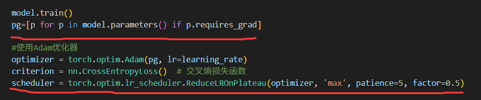

## 分类

### #概念理解

#### 1.分类任务的输出是什么？它和回归任务的输出有什么本质不同？

- 分类问题的输出是离散的类别标签
  
- 回归任务输出的是连续的数值

#### 2.什么是“二分类”问题？什么是“多分类”问题？请分别举一个例子。怎么实现二分类和多分类？

- 二分类是要把样本划分到两个互斥的类别中去（使用逻辑回归或者决策树，向量机找到决策边界）
  
- 多分类是要把样本划分到三个或以上的互斥类别中去（可以用softmax回归，CNN或者决策树随机森林）

#### 3.评价分类模型指标有哪些？

- 准确率（accuracy）：正确分类的样本占样本总数的比例
  
- 精确率（pricision）：预测为正类的样本占正类样本总数的比例

- 召回率（recall）：实际为正类样本中被预测为正类的比例
  
- F1分数（F1_score）：是精确率和召回率的调和平均数

- 混淆矩阵（confusion matrix）

- ROC曲线和AUC值

（当然倒过头来看，实际上我们根本没用上这么多指标，一般就计算准确率和F1分数，还有通过混淆矩阵直观体现，其他暂时还没涉及到）

---

### #多分类代码实操

首先还是一个复制粘贴（我都以moon为模板）
然后开始更改

可以看到对比housing的fetch，这里获取iris数据用的就是load
所以我们需要多去互联网上学习，查证，避免像我一样下载不了数据以为必须要自己生成（捂脸）

其实我们可以看到基本都一样，换汤不换药

除了之前删除labels的操作，我又学会了有选择的获取数据

就是用iloc

逻辑回归就是线性回归的变种
所以也只有一层

接下来还是大差不差

分类问题我们都需要计算准确率作为判断
**（不是我怎么没算损失啊，这对吗？!这怎么正确运行的啊？!）**

当然，由于逻辑回归是用于进行二分类的，我们把它用于多分类就需要加入softmax获取概率

我没截到原来的代码，原来这里跟moons几乎一模一样，但是最后运行的test准确率太低
我不得不尝试其他一些东西以提高我的准确率

所以我采用了参数更新列表pg和学习率调度器scheduler

model.parameters会获取模型中所有参数
p.requires_grad判断参数p是否需要梯度，即是否需要被更新
后续优化器Adam只需要对这里的参数进行调整即可

torch.optim.lr_scheduler.ReduceLROnPlateau是一种基于指标plateau（趋于平稳）的学习率调整策略
optimizer指调整学习率的优化器（Adam）
max表示监控的指标是最大化的（当准确率不再上升时就调整学习率）
patience=5表示当监控的指标在连续5个epoch内没有改善就会降低学习率，帮助模型收敛

然后就是正常操作，但是要记得我们需要更新学习率
（原来我计算了损失，只不过前面没算再后面而已，为什么我要到处乱改啊？
难不成时ai帮我改的我没注意？
所以我说ai烦得很，我只想让它帮我解决阻止运行的错误，但是它老是自以为是的帮我修改我微乎其微的小毛病）

接下来就比较有意思了

我不是还没看过iris数据，就打算去skicit_learn上瞄一眼

然后就打开了这个三维数据图，正好在iris子录下面

我说妙啊这个，我说正好这个任务有好多features

于是就把这个3d图代码copy过来了

**（倒回来的我有一个小问题：我发现我自己绘图用的都是plt，然后task3学长/学姐给的和这个库上都是ax，这两者有什么区别？应用有何不同吗？因为后面任务我进行了实验，这两者似乎完全可以替换，我就在task4把一个copy的ax绘图完全改为了plt）**

剩下的就几乎完全一样了

于是我开始了运行

果然，不出所料，报错了

OK看不懂，交给ai吧

（什么时候可以更新一下报错系统，这个报错也太糟糕了，看不懂呀）

ai说如果路径存在证明已经下载了，需要读入，如果路径不存在才需要下载

我们就可以正常运行得到结果了

正确率很高欸，大功告成啦！

---

### #ideas1&questions

- 逻辑回归也只有一层，最开始我没有添加其他东西，也没有将epoch增加至500时准确率很低，是否说明逻辑回归实际上不适合用于多分类问题？

- 所以为什么要让我们使用逻辑回归进行多分类而不是其更适合的二分类呢？

- 四个features在PCA里被压缩为三维，这个过程到底是如何压缩的？

- 如前文，plt和ax绘图工具有何区别？二者是否可以替换？

- 在遇到准确率极低时，我们可以考虑加入学习率调整器sheduler和更新参数表pg，还可以增加epoch减小learning_rate，如果还不行，那就勇敢的换个模型吧

- 关于提问：混淆矩阵对角线上数量代表预测成功样本，四周代表预测失败样本，可直观看到预测结果

