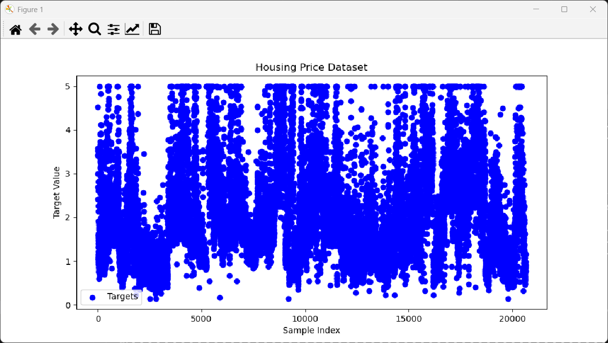

## 回归

### #概念理解

> 回归和分类是机器学习中最常见和基础的两种任务，它们的根本区别在于预测的结果是什么：
• 回归：预测的是一个具体的数值。比如预测明天的气温、估算房屋的价格，或者推断一个人的收入。它的结果是连续的数字。
• 分类：预测的是一个类别。比如判断一张图片是猫还是狗、识别一封邮件是不是垃圾邮件，或者判断用户喜欢还是不喜欢某个产品。它的结果是有限的几个选项。

>很多算法既可以做回归，也可以做分类，只是稍微调整一下就可以了。比如决策树、神经网络这些方法，都有分别处理这两种任务的版本。
有趣的是，回归和分类之间常常可以互相转换：
• 回归的结果可以通过设定“阈值”变成分类。比如血糖值高于某个数就是“高血糖”，低于就是“正常”。
• 分类模型（比如逻辑回归）常常先输出一个概率（属于0到1之间的数值），再根据概率大小决定最终类别——所以其实它内部也用了回归的思想。

#### 1.在预测房价的模型中，模型的输出是什么？它是连续的还是离散的？

- 输出的是**预测值**，是**连续**的

#### 2.什么是“线性回归”？试着用一句话描述它是如何工作的。解释你在高中学习的“最小二乘法”的原理。

- 线性回归是利用数据分析，建立两个或多个变量之间的固定关系的一种统计分析方法：它通过拟合线性方程来描述自变量和因变量之间的线性关系

- 最小二乘法：通过寻找**最小残差平方和**确定使得实际值与预测值差异最小的线性方程的系数
  

#### 3.评价一个回归模型的好坏，常用的一个指标有什么？

- 决定系数$R^2$(或者均方误差MSE)
  
  $R^{2}=1 - \frac{\sum_{i = 1}^{n}(y_i - \hat{y}_i)^2}{\sum_{i = 1}^{n}(y_i - \bar{y})^2}$

---

### #实践

首先进行一个大复制粘贴，把所有moons的内容先搬运到这里来
然后更改

对我之前下载不了数据就是这一步错了，每个数据库需要不同的读取方式，这里用的是fetch

然后就是正常的读取，之前用data和label作为数据特征和类别，这里是回归问题，于是我改为了更清晰的features和targets（目标值）

**删去标签列很重要！！我们只需要数据！！**

最后添加了一个Dataframe，把数据都整理起来

（倒回来发现神经网络结构没改，我在用神经网络做线性回归啊，当时根本就没明白这几个模型的区别，遂补上
**注意线性回归只有一层，没有隐藏层**）

*这样只有一层就感觉效果不会好*

因为线性回归找的是y，即通过特征拟合出来的预测值，所以我们就不需要准确率了，并且我们需要对比预测值与真实值，所以把储存准确率的字典改为储存预测值与真实值

再进行遍历获得这些值

对了，损失函数用MSE，适用于线性回归的一种函数

这一步是为了收集数据
CPU是将储存在GPU的值移出来，因为numpy数组只能再CPU上计算
numpy将张量转化为numpy数组
tolist将numpy数组转化为python的列表，以便后续保存

我因为这个没有转化报错了一次

完全不明白，然后咨询了ai
才知道了正确做法

然后计算r_2

当然了，我是搬运的，根本不会公式

（倒回来才知道这玩意儿有专门的函数去算，直接调用就可以，我是傻子）

删去关于准确率计算的，添加loss和r2的保存

_, _ 是因为evaluate有四个返回值，我们只需要前两个，用下划线空接收剩下两个
最后保存权重

增加一个子图可视化r2，对的我是搬运的，关于可视化这一块我都有点看不懂

还有这个真实房价vs预测房价的图，我搜索了一下说中间那一段是为了取max和min保证覆盖范围？

对了不要决策边界了（这是分类问题需要的东西）

in_size咱也不知道是多少，反正就是特征数

这下面初始化这里，**注意上面train_model定义了多少变量下面就要赋值多少变量，不能多也不能少**

天知道我这里错了多少次
惨痛教训 * N

调用上列函数

运行一下

运行的时候我还经历了数据保存的路径问题，如下：

然后我求助了ai

根据ai所言我将保存路径进行了修改

（倒回来发现原来我这么早就遇到了路径问题，后面还遇到了许多次（哭））

---

### #ideas&questions

- 关于数据的转化不是很清楚，中间那个张量转numpy转列表是ai帮忙找到的错误，不太明白什么时候需要转化？

- 相对路径与绝对路径：相对路径从根目录下打开，比较稳定；绝对路径从当前工作目录打开，不稳定
但是用os是不是只可以用相对路径？？好像看到别人的代码都是os和相对路径一起使用

- 线性回归只有一层，拟合效果如何保证？

- 线性回归不需要准确率和决策边界，损失函数用MSE

