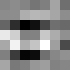
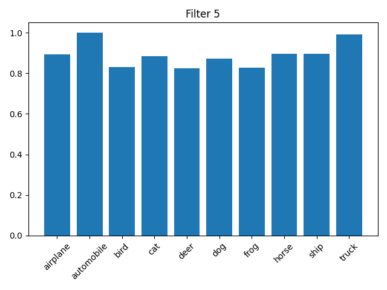
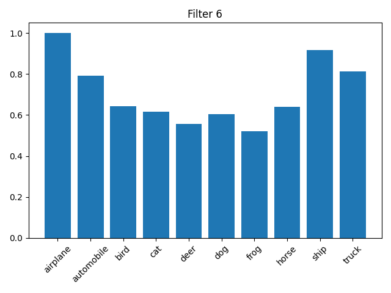
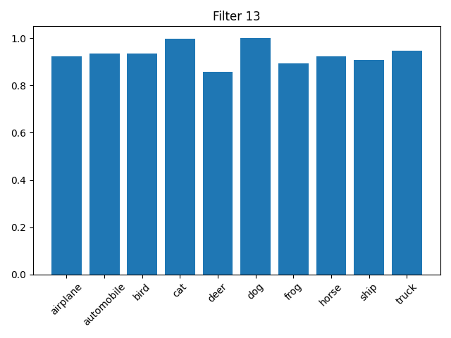
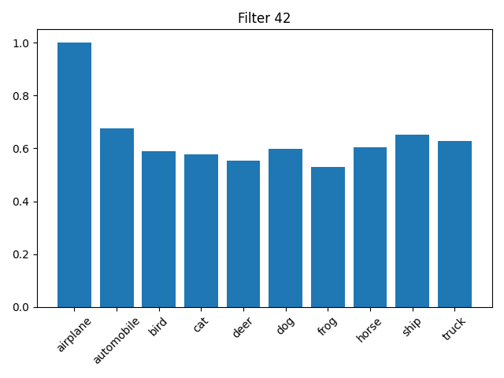
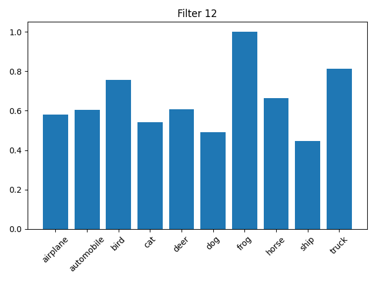
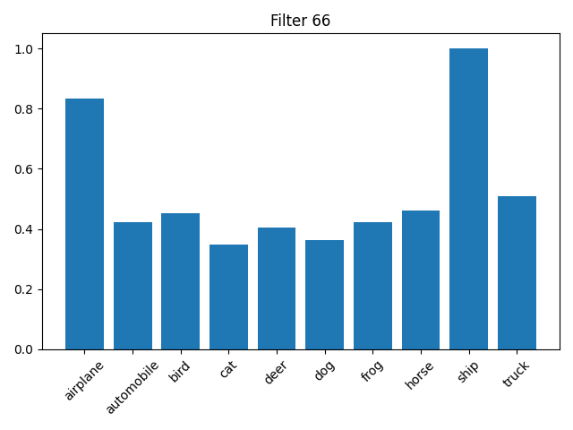

# CNN模型卷积核分析报告

## 概述

本报告分析了CNN模型中第一层和最后一层卷积核的特征及其对CIFAR-10数据集不同类别的响应模式。CIFAR-10数据集包含10个类别：airplane、automobile、bird、cat、deer、dog、frog、horse、ship、truck

## 卷积核柱状图分析

### 第一层卷积核分析(classwise_avg_0)

第一层卷积核共有16个7×7的卷积核，主要响应低层次视觉特征。以下是部分卷积核的可视化效果：

**代表性卷积核：**
- Filter 5：对automobile和truck类别响应明显，具体捕获了矩形和圆角形状特征，这与车辆的车窗、车灯和车身轮廓高度相关
  

- Filter 6：对airplane、ship类别有较强响应，具体学习了水平和倾斜边缘特征，这类特征在飞行器机翼和船只轮廓中普遍存在
  

- Filter 8：对frog和cat类有较高激活值，具体学习了圆形纹理和斑点模式，这可能对应于青蛙的皮肤纹理和猫的毛发特征
  

**主要特点：**
- 卷积核通常对多个类别有响应，类别区分度较低
- 激活值分布相对均匀，没有特别突出的类别偏好
- 主要学习通用视觉特征，如边缘、纹理和简单形状

### 最后一层卷积核分析(classwise_avg_4)

最后一层卷积核共有80个3×3的卷积核，经过三次池化操作后，感受野更大，主要响应高层次语义特征

**代表性卷积核：**
- Filter 42：几乎只对airplane类别有强烈响应，具体学习了机翼与机身的组合特征、尾翼结构以及特定的空中姿态特征，形成了高度特异性的飞机轮廓模式
  
- Filter 12：对frog类有显著激活，具体学习了青蛙的特征组合（包括身体形状，四肢轮廓和面部结构）以及特定的周围水域环境模式
  
- Filter 68：主要响应ship类别，具体学习了船体的独特结构特征、甲板布局模式以及与水面的交界特征（可见对airplane也有较强响应，可能因为飞机具有与船相似的流体形状和较暗颜色，周围环境天空和水面也具有相似的颜色和质感）
  

**主要特点：**
- 卷积核表现出明显的类别特异性，大多数只对1-2个类别有强响应
- 激活值分布不均匀，通常有1-2个类别显著高于其他类别
- 学习到的是更抽象、更具语义信息的特征表示

## 第一层与最后一层的差异分析

| 特征 | 第一层卷积核| 最后一层卷积核|
|------|------------------------------|--------------------------------|
| 卷积核数量 | 16个 | 80个 |
| 卷积核尺寸 | 7×7 | 3×3 |
| 感受野大小 | 较小 | 较大 |
| 响应模式 | 多类别均匀响应 | 1-2个类别主导响应 |
| 特征抽象程度 | 低层次视觉特征 | 高层次语义特征 |

## 模型学习的特征层级表示

根据CNN模型的架构，特征学习呈现明显的层级结构，每层学习到的具体特征如下：

1. **第一层(conv1)**：学习原始像素级的具体低层次特征，包括：
   - 各种方向的边缘检测（水平、垂直、对角线）
   - 基础纹理模式（条纹、斑点、网格）
   - 简单几何形状的基本组件（线段、曲线、角点）
   这些特征对多个类别有普遍响应，构成了视觉认知的基础元素

2. **中间层(conv2-conv4)**：通过层层抽象，特征逐渐变得更加复杂和具有区分性：
   - conv2：开始组合边缘形成简单形状（圆形、矩形、三角形）和局部纹理模式
   - conv3：学习更复杂的组合特征，如眼睛区域、车轮形状、翅膀结构等
   - conv4：特征进一步抽象，开始形成具有部分语义含义的组件
   每层通过池化操作扩大感受野，整合更多局部信息

3. **最后一层(conv5)**：学习到高度抽象的语义特征：
   - 完整的物体部件或特定类别特有的特征组合
   - 具有明确语义含义的模式（如飞机的整体轮廓、青蛙的形体特征）
   - 对特定类别具有高度选择性的激活模式
   每个卷积核通常专门响应特定类别的关键特征组合，这为最终的分类决策提供了基础

## 结论

通过分析第一层和最后一层卷积核的柱状图，我们可以观察到CNN模型的特征学习过程是一个从通用到专用、从简单到复杂的层级抽象过程，第一层捕获的是基础视觉元素，而最后一层则形成了高度类别特异性的特征表示，这正是深度学习模型能够有效进行图像分类的关键机制
